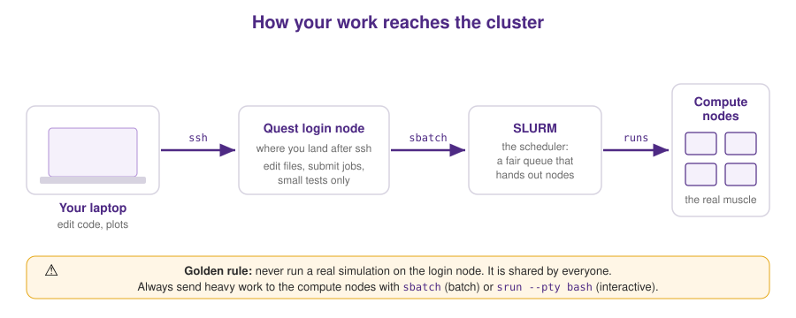

# Module 2 — The Cluster: Quest & SLURM

> **Why this matters for us.** A single meaningful MD simulation can need hundreds
> of processor-cores running for hours or days. Your laptop can't do that. Quest
> — Northwestern's high-performance computing cluster — can. Learning to use it
> politely and efficiently is the difference between getting results this week and
> waiting three months.



---

## What a cluster actually is

Picture a warehouse full of powerful computers (**nodes**) wired together. You
never touch them directly. Instead:

1. You **`ssh`** into a **login node** — a small shared front desk.
2. From there you **submit jobs** describing the work you want done.
3. A traffic cop called **SLURM** (the *scheduler*) finds free **compute nodes**
   and runs your job when resources are available.

> ⚠️ **The golden rule of clusters:** the login node is a shared front desk, not a
> workbench. Never run a real simulation there — you'll slow everyone down and
> admins will notice. Heavy work *always* goes to compute nodes via SLURM.

---

## Getting on: SSH

From your laptop's terminal:

```bash
ssh YOURNETID@quest.northwestern.edu
```

Type your password (you won't see it appear — that's normal) and complete Duo.
You're now on a login node.

**Save yourself the daily typing** with SSH keys (set up once, log in forever
without a password):

```bash
ssh-keygen -t ed25519                 # press Enter through the prompts
ssh-copy-id YOURNETID@quest.northwestern.edu
```

New to the cluster? Access is requested through Northwestern Research Computing.
Ask a labmate or check the current docs at **rcdsdocs.it.northwestern.edu**, and
email **quest-help@northwestern.edu** when you're stuck — they're genuinely helpful.

---

## Where your files live (and don't lose them)

Clusters separate storage on purpose. Know the difference:

| Location | Path | Use it for | Watch out |
|---|---|---|---|
| **Home** | `~` (`/home/<netid>`) | your personal software, compiled code, scripts, `.bashrc` | small quota — **not** for research data or production runs |
| **Project** | `/projects/<allocation>/` | research data, simulations, datasets | you get this **only after a research allocation is approved** |
| **Scratch** | (cluster scratch space) | huge temporary run output | fast but **may be purged** — never your only copy |

> 💡 **Where do I start?** In your **home directory** — everyone gets one the moment
> their Quest account is active, so you can begin immediately. But home is for *you*:
> installing personal software, compiling LAMMPS, keeping small scripts and configs. It
> has a small quota and **isn't the place to store research data or run big production
> jobs**.
>
> To get real space and compute for research, you (or your advisor) **apply for a
> research allocation** through Northwestern Research Computing. Once it's approved you
> get a project directory (`/projects/<allocation>/`) for data and an **allocation ID**
> — a code like `pXXXXX` — that your jobs charge to. Until then, home is enough to work
> through this tutorial. Apply early; it can take a little time.

**Moving files between your laptop and Quest:** (start with home; use your project
path once you have an allocation)
```bash
# copy TO the cluster (into your home directory to start)
scp results.py YOURNETID@quest.northwestern.edu:/home/YOURNETID/

# copy FROM the cluster (run this on your laptop)
scp YOURNETID@quest.northwestern.edu:/home/YOURNETID/plot.png .

# for large folders, rsync is smarter (only copies what changed)
rsync -avz my_run/ YOURNETID@quest.northwestern.edu:/home/YOURNETID/my_run/
```

> 🧭 **The comfortable way to work on Quest: VS Code Remote-SSH.** Instead of editing
> files blind over the terminal, open VS Code, hit `Ctrl+Shift+P` → **Remote-SSH:
> Connect to Host**, and enter `YOURNETID@quest.northwestern.edu`. Now you're editing
> files *on the cluster* with your full editor — syntax highlighting, file tree,
> integrated terminal — as if they were local. This is how most of us work day to day.
> For **bulk drag-and-drop transfers**, a visual SFTP client (MobaXterm or Bitvise on
> Windows; FileZilla or Cyberduck anywhere) is handy, and for **very large datasets**
> Quest supports **Globus**. See [Module 0](00_setup.md) for all three.

---

## Software: the `module` system

The cluster has hundreds of programs installed, kept out of your way until you ask
for them. `module` is how you ask.

```bash
module avail                 # what's installed?
module spider lammps         # search for a specific package + its versions
module load lammps           # load it into your session
module list                  # what do I have loaded right now?
module purge                 # unload everything (start clean — great for reproducibility)
```

Always `module purge` at the top of a job script, then load exactly what you need.
Future-you re-running the job in six months will thank present-you.

---

## SLURM: submitting and watching jobs

You describe a job in a small bash script full of `#SBATCH` lines (requests to the
scheduler), then submit it. Here's the anatomy — see
[`scripts/slurm_lammps_template.sh`](../scripts/slurm_lammps_template.sh) for a
ready-to-edit copy:

```bash
#!/bin/bash
#SBATCH --account=pXXXXX          # your research allocation ID (you get this when it's approved)
#SBATCH --partition=short         # which queue: short (<4h), normal (<48h), long (<7d)
#SBATCH --nodes=1                 # how many machines
#SBATCH --ntasks-per-node=16      # how many parallel processes per machine
#SBATCH --time=01:00:00           # wall-clock limit — job is KILLED when it hits this
#SBATCH --mem=8G                  # memory per node
#SBATCH --job-name=my_first_job
#SBATCH --output=slurm.%j.out     # where printed output goes (%j = job number)

module purge
module load lammps
cd $SLURM_SUBMIT_DIR
srun lmp -in deform.in            # the actual work
```

The everyday commands:

```bash
sbatch myjob.sh          # submit it -> prints a job ID
squeue -u $USER          # is my job running or waiting?
scancel <jobid>          # kill a job
sinfo                    # which partitions exist and how busy are they?
sacct -j <jobid>         # after it finishes: did it succeed? how long? how much memory?
```

**Reading `squeue`:** the `ST` column is the status. `R` = running, `PD` = pending
(waiting in line), `CG` = completing. If it sits at `PD` a while, you may be asking
for more than's free — try a shorter time or fewer nodes.

---

## Testing interactively (before you commit to a batch job)

Debugging a broken job through the queue is slow. Instead, grab a compute node and
work on it live:

```bash
srun --account=pXXXXX --partition=short --nodes=1 --ntasks-per-node=4 \
     --time=1:00:00 --pty bash
```

*(Replace `pXXXXX` with your allocation ID once you have one — see the storage section
above.)*

Now you have a real compute node prompt. Load modules, run a *tiny* version of your
job by hand, watch it work or fail immediately, fix it, then scale up in a batch
script. This single habit will save you weeks over a PhD.

---

## Parameter sweeps: job arrays (this is how we do science)

Most of our questions are "how does property X change as I vary knob Y?" That means
running the *same* simulation many times with different inputs. A **job array**
does exactly that with one submission:

```bash
#SBATCH --array=0-3            # launches 4 jobs, with SLURM_ARRAY_TASK_ID = 0,1,2,3

MODES=(tensile compression shear dilation)
MODE=${MODES[$SLURM_ARRAY_TASK_ID]}

srun lmp -in deform.in -var mode $MODE
```

One `sbatch` and you've launched all four deformation modes at once, each on its
own node. Sweeping crosslink density over 20 values? `--array=0-19`. This is the
backbone of building the datasets that train models like TANGO.

---

## 🤖 Use your AI assistant here

A great, honest use of an AI assistant on the cluster:

> "Here is my SLURM script and the error it produced: [paste both]. Walk me through
> what the error means and the most likely fix. Explain *why* — I want to recognize
> this class of error myself next time."

SLURM errors are famously cryptic (`sbatch: error: Batch job submission failed:
Invalid account or account/partition combination`), and an assistant is excellent
at decoding them. Just confirm the fix by re-submitting — the cluster is the final
judge, not the chatbot.

---

## ✅ Checkpoint

You're ready to move on when you can:
1. SSH into Quest and explain the difference between the login node and a compute node;
2. submit the template job, watch it with `squeue`, and find its output file;
3. describe what a job array is good for in one sentence.

**Next:** [Module 3 — Compiling LAMMPS →](03_compiling_lammps.md)
