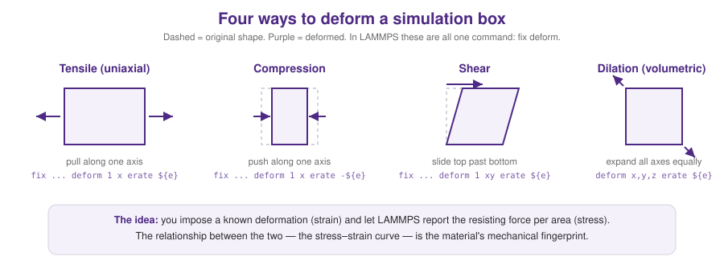

# Module 4 — Molecular Dynamics & Deforming Materials

> **Why this matters for us.** This is the lab's engine room. Everything upstream
> (terminal, cluster, LAMMPS) existed so you could get *here*: build a virtual
> material, deform it in a controlled way, and watch how it responds. That response
> — the stress–strain curve — is the raw data behind every model and every paper we
> write.

**This is the longest module. Take it in two sittings:** first *run* something,
then *deform* something.

---

## Part A — What molecular dynamics is doing

Molecular dynamics (MD) is stunningly simple at its heart. It's Newton's law,
`F = ma`, applied to every particle, over and over:

1. Look at where all the atoms are.
2. Compute the force on each one from all the others.
3. Nudge each atom forward a tiny **timestep**.
4. Repeat a few million times.

The result is a physically faithful movie of atoms in motion. Two pieces decide
whether that movie is trustworthy:

**The potential** — the rulebook for how particles push and pull on each other.
The classic one is the **Lennard-Jones (LJ)** potential: atoms repel hard when too
close and attract gently at medium range. For polymers we add **FENE bonds** —
springs that connect beads into chains but can't stretch infinitely. (Arman's
[**Interatomic_Potential_Functions**](https://github.com/ArmanMoussavi1/Interatomic_Potential_Functions)
notebook is a great, visual way to build intuition for these — run it.)

**The ensemble** — what we hold fixed. You'll see these three constantly:

| Ensemble | Holds constant | LAMMPS fix | Use it for |
|---|---|---|---|
| **NVE** | energy | `fix nve` | pure Newtonian dynamics (rarely alone) |
| **NVT** | temperature | `fix nvt` | equilibrating at a set temperature |
| **NPT** | temperature **and** pressure | `fix npt` | letting a box find its natural density |

A **thermostat** keeps temperature steady; a **barostat** keeps pressure steady.
They're the knobs that keep your virtual experiment at realistic conditions.

### Coarse-graining, and why we use "LJ units"

We rarely simulate every atom — that's too slow. Instead we lump groups of atoms
into **beads** (coarse-graining) and work in **Lennard-Jones units**, where
energy, length, and time are all dimensionless. Don't let the missing units unsettle
you: it makes the physics general (one simulation stands in for a whole family of
real polymers) and it's the native language of the **Kremer–Grest** bead-spring
model we use for polymer networks.

---

## Part B — Anatomy of a LAMMPS input script

Every LAMMPS run is a text file read top to bottom. The structure is always the
same five acts:

```bash
# 1. SETTINGS — what kind of world is this?
units        lj
atom_style   molecular
boundary     p p p               # periodic in x, y, z

# 2. GEOMETRY — put atoms somewhere
read_data    melt.data           # (or create_atoms / read_restart)

# 3. FORCES — the rulebook
pair_style   lj/cut 2.5
pair_coeff   * * 1.0 1.0
bond_style   fene
bond_coeff   * 30.0 1.5 1.0 1.0

# 4. WHAT TO DO — integrate, control temperature, output
fix          1 all nvt temp 1.0 1.0 0.5
thermo       1000
dump         traj all custom 5000 out.lammpstrj id type x y z

# 5. RUN
timestep     0.005
run          100000
```

If you can read those five acts, you can read any LAMMPS script in the lab.

### Your very first run: a canonical example

Before touching our own systems, run one of the **examples that ship with LAMMPS**.
They're battle-tested and perfect for confirming your setup works:

```bash
# inside the LAMMPS source tree
cd examples/melt
lmp -in in.melt          # a simple Lennard-Jones fluid — should finish in seconds
```

Watch the numbers scroll by (temperature, energy, pressure). Congratulations —
you just ran molecular dynamics. The `bench/in.chain` example is the bead-spring
**polymer** analog; run that next.

> 🖼️ **[placeholder: screenshot of your terminal running `in.melt`, thermo output scrolling]**

---

## Part C — Building *our* materials

The canonical examples use throwaway geometries. For real work we build structured
systems. Arman's
[**build_polymer_systems**](https://github.com/ArmanMoussavi1/build_polymer_systems)
does this: `build_melt.py` grows coarse-grained polymer chains bead-by-bead into a
box and writes out a LAMMPS `data` file (positions, bonds, angles). Clone it and
read the code — it's clean and shows exactly how a `.data` file is assembled:

```bash
git clone https://github.com/ArmanMoussavi1/build_polymer_systems.git
cd build_polymer_systems
python build_melt.py        # produces a .data file you can feed straight into deform.in
```

For nanoparticle-reinforced systems, see
[**KG_PGNs**](https://github.com/keten-group/KG_PGNs) — the polymer-grafted
nanoparticle models behind Arman's published shear-response study. For measuring how
tangled a network is, see
[**polymer_entanglement_analysis**](https://github.com/ArmanMoussavi1/polymer_entanglement_analysis).

> 🖼️ **[placeholder: OVITO render of a freshly built coarse-grained polymer melt]**

---

## Part D — Deformation: the whole point

Now we make the material *do* something. **Deformation** means imposing a known
change of shape (a **strain**) and measuring the force the material fights back with
(a **stress**). LAMMPS does all four canonical modes with a single command,
`fix deform`:



- **Tensile** — pull along one axis. *"How strong is it when stretched?"*
- **Compression** — push along one axis. *"How does it resist being squished?"*
- **Shear** — slide the top past the bottom. *"How does it resist sliding/twisting?"*
- **Dilation** — expand every axis equally. *"How does it resist changing volume?"*

> 🏛️ These are the same load cases a structural engineer runs on a beam or column —
> tension, compression, and shear are the bread and butter of mechanics at *every*
> scale. We're just applying them to a molecular network instead of a steel section.

The ready-to-run script is [`scripts/deform.in`](../scripts/deform.in). It handles
all four modes through one switch, so you learn *one* script instead of four:

```bash
lmp -in deform.in -var mode tensile     -var erate 1.0e-3
lmp -in deform.in -var mode compression -var erate 1.0e-3
lmp -in deform.in -var mode shear       -var erate 1.0e-3
lmp -in deform.in -var mode dilation    -var erate 1.0e-3
```

Each run writes `stress_strain.txt` — two columns, strain and stress — which feeds
directly into Module 5. Open `deform.in` and read the comments; the key line is:

```bash
fix 2 all deform 1 x erate ${erate} remap x     # <- impose the strain, at a chosen rate
```

### The one subtlety that trips everyone up: strain rate

`erate` is how *fast* you deform. Pull too fast and the polymer chains can't relax
between steps — you measure the strain rate, not the material. **Slower is more
physical, but costs more compute time.** Getting a feel for this tradeoff is a rite
of passage; run the same mode at a few rates and watch the curve change. When in
doubt, slower.

> 🖼️ **[placeholder: side-by-side OVITO snapshots — undeformed box vs. the same box under tension, near fracture]**

---

## Part E — Seeing your simulation

Numbers are truth, but pictures build intuition. The `dump` line in `deform.in`
writes `deform.lammpstrj`, a trajectory file. Open it in:

- **OVITO** (recommended) — drag the `.lammpstrj` file in, hit play. Free, fast,
  gorgeous. Great for spotting where a network fails.
- **VMD** — the classic alternative, more features, steeper learning curve.

Watching a network neck, void, and tear on screen is when the mechanics stops being
abstract. Do it early and often.

---

## 🤖 Use your AI assistant here

Two genuinely good uses, and one boundary:

**Good — explain and scaffold:**
> "Here's my `deform.in` script. Explain what `remap x` does in the `fix deform`
> line and why shear needs a triclinic box. I want to understand it, not just copy."

**Good — translate an idea into a starting script:**
> "Sketch a LAMMPS input that equilibrates a bead-spring melt in NPT, then applies
> uniaxial tension in x while letting y and z relax to zero pressure. Comment every
> line. I'll verify each command against the LAMMPS docs before I run it."

**The boundary:** an assistant will confidently produce LAMMPS commands that are
subtly wrong or version-mismatched. *Always* check generated commands against the
official LAMMPS documentation and — the real test — whether the simulation runs and
gives physically sane numbers. The cluster doesn't care how confident the chatbot
was. (More in [Module 7](07_ai_assistants.md).)

---

## ✅ Checkpoint

You're ready to move on when you can:
1. run a canonical LAMMPS example to completion;
2. run at least two deformation modes from `deform.in` and produce a `stress_strain.txt`;
3. explain, in plain words, what strain rate is and why "slower is more physical";
4. open a trajectory in OVITO and watch it deform.

**Next:** [Module 5 — Extracting Mechanical Properties →](05_mechanical_properties.md)
