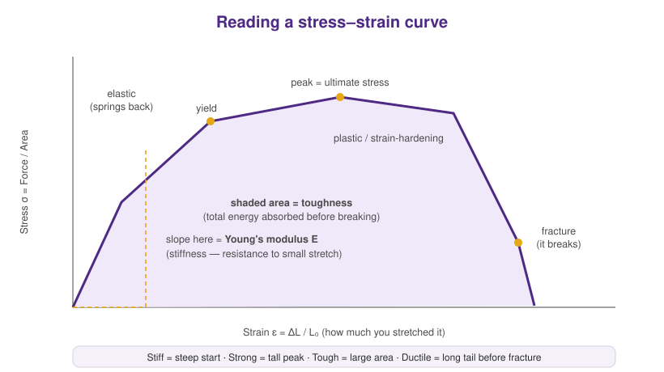

# Module 5 — Extracting Mechanical Properties

> **Why this matters for us.** A stress–strain curve is a wiggly line until you know
> how to read it. Turning that line into *numbers* — stiffness, strength, toughness
> — is how a simulation becomes a scientific claim. These numbers are the
> "properties" in the **structure → property** relationships that the entire lab is
> built to understand and, eventually, to design.

---

## The curve is the material's fingerprint

Every deformation run in Module 4 gave you a `stress_strain.txt`. Plotted, it looks
like this — and almost everything you care about is labeled right on it:



Read it left to right, the way the material experiences the load:

1. **Elastic region (the initial straight part).** The material stretches and would
   spring back if you let go. The *slope* here is the **Young's modulus, E** — its
   **stiffness**. Steep = stiff.
2. **Yield point.** Where it stops springing back and starts permanently changing.
3. **Peak (ultimate stress).** The most stress it can bear — its **strength**.
4. **Fracture.** Where it breaks and stress collapses.
5. **The whole area under the curve** = **toughness**, the total energy it soaked up
   before failing. This is often what we care about most: a tough material absorbs a
   lot of punishment before breaking.

Four words capture the personalities:

- **Stiff** — steep initial slope (resists small stretch)
- **Strong** — tall peak (bears high stress)
- **Tough** — big area (absorbs lots of energy)
- **Ductile** — long tail before fracture (stretches far first)

A material can be strong but brittle (glass), or weak but tough (a rubber band).
Teasing these apart is the daily craft of mechanics.

> 🏛️ **Seen this curve before?** If you've taken a mechanics-of-materials course —
> as any civil or structural engineer has — this is the *same* stress–strain curve
> you plotted for a steel or concrete specimen: the same elastic slope, yield point,
> ultimate strength, and failure. That's the quiet through-line of this work: the
> mechanics an engineer uses to reason about a bridge or a beam are the same
> mechanics governing a molecular network. **The length scale changes by a factor of
> a billion; the physics doesn't.** We're just measuring that curve for a material we
> designed atom by atom.

---

## From curve to numbers, automatically

You won't eyeball these by hand — you'll script it. The script
[`scripts/stress_strain.py`](../scripts/stress_strain.py) reads a `stress_strain.txt`
and extracts every property above:

```bash
python stress_strain.py stress_strain.txt --elastic-limit 0.03
```

Output:

```
  mechanical properties (LJ units)
  --------------------------------------
  Young's modulus  E        :    31.80
  ultimate stress           :     3.22   at strain 0.340
  toughness (area to peak)  :     0.85
  fracture strain (~50% drop):    0.917
  saved figure -> stress_strain.png
```

**Read the script** — it's short and every property is computed transparently:

- **Modulus** = a straight-line fit to the low-strain data (`np.polyfit`).
- **Ultimate stress** = the maximum (`np.argmax`).
- **Toughness** = the area under the curve (`np.trapezoid` — numerical integration).
- **Fracture strain** = where stress first falls past half its peak.

Once you understand those four moves, you can compute any mechanical descriptor you
invent. That habit — *know exactly how your numbers were made* — is what separates a
result you can defend from one you can't.

> 🖼️ **[placeholder: your own stress_strain.png output, once you've run a real deformation]**

---

## Where the physics gets interesting

The individual numbers are just the beginning. The questions the lab actually chases
live one level up:

- **How does each property change as I change the structure?** Stiffer with more
  crosslinks? Tougher with more entanglements? These are **structure–property
  relationships** — the heart of the whole enterprise.
- **Can I compare against a theory?** Classical models predict some of these from
  topology alone — the **affine** and **phantom** network moduli, the **Lake–Thomas**
  fracture energy. Computing your MD number *and* the theoretical one, and asking why
  they differ, is real science. (These same benchmarks anchor TANGO and the lab's
  law-discovery work.)
- **Can I classify the response?** Stiff, ductile, tough, brittle, damage-tolerant —
  putting quantitative metrics on these archetypes lets us map the whole landscape of
  what a polymer network *can* be.

This is the pivot point of the tutorial. Up to now you've been *measuring* one
material at a time. The lab's real goal is to understand the *rules* connecting all
of them — and that's where machine learning enters.

---

## A note on rigor (please internalize this)

- **Units.** Everything here is in LJ units. Track them. A modulus of "31.8" is
  meaningless until you know it's `31.8 ε/σ³`.
- **Averaging & noise.** MD is thermal and jittery. One run is a sample, not the
  truth. For a real result you average several independent runs (different random
  seeds) and report the spread. Never report a property from a single simulation as
  if it were exact.
- **Convergence.** Did you deform slowly enough? Big enough box? Long enough
  equilibration? If the number changes when you change these, you haven't found the
  material's property yet — you've found an artifact.

---

## 🤖 Use your AI assistant here

Analysis is where assistants shine *and* where they can quietly mislead — so this is
the perfect place to practice verifying:

> "Here's my stress-strain analysis script and a plot of the result. Does my
> Young's-modulus fit look like it's using a sensible strain range? Suggest a
> sanity check I can run myself to confirm the elastic region is really linear."

Good uses: refactoring analysis code, suggesting sanity checks, explaining a
statistical method, drafting a clean matplotlib figure. The thing to *never*
outsource: deciding whether a number is physically believable. That judgment is your
job as the scientist — build it deliberately.

---

## ✅ Checkpoint

You're ready to move on when you can:
1. point to the modulus, yield, ultimate stress, and toughness on a plotted curve;
2. run `stress_strain.py` on your own data and explain how each number was computed;
3. say why one simulation isn't enough to report a property.

**Next:** [Module 6 — AI for Materials (a gentle first taste) →](06_ai_for_materials.md)
