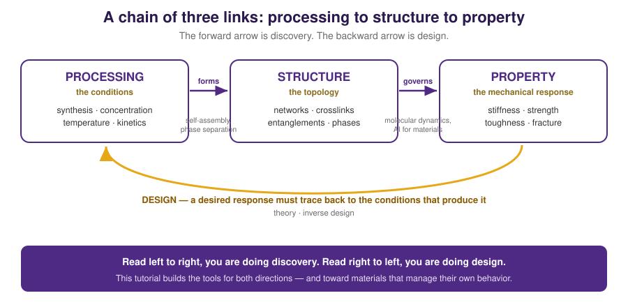
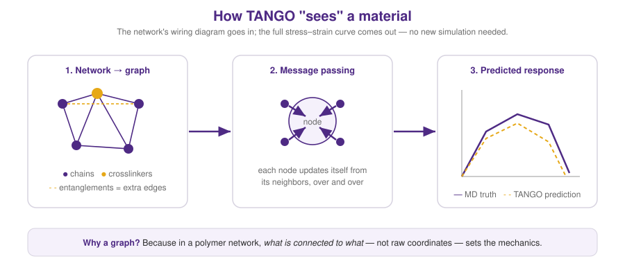

# Module 6 — AI for Materials (A Gentle First Taste)

> **Why this matters for us.** This is where the two halves of the lab meet. You now
> know how to measure a material's mechanics with MD. But MD is *slow* — hours per
> structure. If we want to understand the rules connecting **every** possible
> structure to its properties, or design a new material to hit a target, we can't
> simulate our way there one run at a time. Machine learning is the amplifier that
> makes it possible. This module builds the intuition from the ground up, using two
> tiny examples you can run today.



---

## The lab's stance on AI (read this first)

There's a lot of hype about "AI scientists." **That is not what we do, and it's
worth being clear about why.** In this lab:

> **Physics-grounded ML is instrumentation — a tool to answer physical questions —
> not a replacement for the physics, and not a scientist.**

The scientific contribution is never "the model said so." It's the physics we
*learn* and the claims we can *defend*: the model is a very fast, very flexible
instrument, like a better microscope. It's judged by whether it helps us discover
something true about materials. Hold onto that framing — it's what keeps the work
honest, and it's the identity of the lab.

---

## Idea 1: a surrogate learns structure → property

Start with the simplest possible version. Suppose a material's structure is one
number (say, its crosslink density) and its property is another (its stiffness).
Each MD run gives you *one* (structure, property) dot — expensively. A **surrogate**
is a cheap model that fits a curve through those dots and predicts everywhere in
between, instantly.

Run it:

```bash
python tiny_surrogate.py
```

[`scripts/tiny_surrogate.py`](../scripts/tiny_surrogate.py) pretends you ran six MD
simulations, fits a surrogate, and does three things that map *exactly* onto the
lab's real work:

1. **Predicts across the whole design space** in microseconds — the payoff. Weeks of
   MD, replaced by a function call.
2. **Reports its own uncertainty.** It doesn't just guess; it says how sure it is.
3. **Picks where to simulate next** — the point it's least sure about. That's
   **active learning**: spend your expensive MD budget where it teaches the model
   the most. This is the beating heart of the lab's closed-loop discovery work.

The output figure says it all: a few dots, a confident prediction where the dots are
dense, honest uncertainty where they're sparse, and a flag planted where the next
simulation should go. That picture *is* the research program, in miniature.

---

## Idea 2: why materials need *graphs*

A single number can't capture a polymer network. What makes a network stiff or tough
isn't a scalar — it's the **wiring**: which chains connect to which crosslinkers,
where the entanglements are, how loops form. You can't flatten a wiring diagram into
one number without throwing away the very thing that matters.

So we hand the model the whole network as a **graph** — nodes for molecules, edges
for bonds — and let it learn directly from the topology. This is the core idea
behind **TANGO**, the lab's graph neural network that predicts a full
stress–strain-to-fracture curve from a network's topology alone.



The mechanism, in plain words: each node starts knowing only about itself, then
repeatedly **passes messages** to its neighbors and updates. After a couple of
rounds, every node "knows" about its local neighborhood; pool them together and you
get a fingerprint of the whole network — which you map to a property.

Run the shrunk-down version:

```bash
pip install torch torch_geometric matplotlib numpy   # ideally in a conda env, see below
python tiny_gnn.py
```

[`scripts/tiny_gnn.py`](../scripts/tiny_gnn.py) builds hundreds of little random
networks, gives each a made-up "stiffness" that depends on its topology, and trains
a 2-layer graph network to predict it from the wiring alone. It's TANGO with the
physics swapped for a toy target — but the *pipeline is identical*:

```
graph in  →  message passing  →  pool to one vector  →  property out
```

When the parity plot lines up, you've watched a model read a property off a wiring
diagram. That's the whole trick. TANGO scales this up to real MD networks and real
fracture curves — and because it's ~1000× faster than MD, it can screen topologies
MD could never reach.

---

## How the pieces connect (the big picture)

Put Modules 4–6 together and you have the lab's loop:

1. **MD** measures real structure → property data (slow, trustworthy).
2. **A surrogate / GNN** (TANGO) learns to predict it (fast, approximate).
3. **The surrogate proposes** the most informative next structure to simulate.
4. **MD tests that proposal** — and stays the final arbiter of truth.
5. Repeat, and the map of structure–property space fills itself in.

And the horizon this is all aimed at: **materials as distributed control systems** —
networks that don't just passively bear load but actively *sense, adapt, and manage
their own damage*. Self-healing screens, fatigue-resistant tissues, materials that
"know what to do." Every skill in this tutorial is a rung on that ladder.

---

## Practical: setting up an ML environment

ML tools have finicky dependencies. Keep them isolated in a **conda environment** so
they never break your other work:

```bash
# on Quest, load the conda module or install miniconda
conda create -n materials-ml python=3.10
conda activate materials-ml
pip install numpy scikit-learn matplotlib torch torch_geometric
```

Activate it whenever you do ML work; `conda deactivate` when you're done. One env
per project is a good rule. GPU nodes on Quest (request a `gpu` partition) will make
training dramatically faster once your models grow.

---

## 🤖 Use your AI assistant here

ML is the area where a coding assistant helps most — and where blind trust hurts
most, because a plausible-looking model can be quietly, confidently wrong.

**Great uses:**
> "Explain what `global_mean_pool` does in `tiny_gnn.py` and why we need it to go
> from per-node features to one prediction per graph."

> "My training loss isn't going down. Here's my code and loss curve. List the three
> most likely causes and a quick diagnostic for each."

**The discipline:** a model that trains cleanly and reports a low error can still be
learning an artifact instead of physics. Always ask: does it generalize to networks
it hasn't seen? Does it respect known limits (a theory it should match)? The
assistant can help you *build* the model; deciding whether it's telling the truth
about materials is your job — the same rigor from Module 5, one level up. (Full
guidance next.)

---

## ✅ Checkpoint

You're ready to move on when you can:
1. explain, to a non-expert, what a surrogate model is and why it's worth training;
2. run `tiny_surrogate.py` and say what "simulate here next" means and why it's smart;
3. explain why polymer networks are represented as graphs, not just numbers;
4. run `tiny_gnn.py` and describe the four-step pipeline in your own words.

**Next:** [Module 7 — Using AI Assistants Responsibly →](07_ai_assistants.md)
